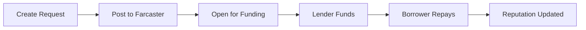

# 💸 LoanCast

> Social lending on Farcaster. No credit checks, no collateral—just reputation.

[](https://vercel.com/new/clone?repository-url=https://github.com/brightseth/loancast)
[](https://loancast.app)
[](https://warpcast.com/loancast)

## 🚀 Overview

LoanCast is a decentralized peer-to-peer lending platform built on [Farcaster](https://farcaster.xyz), enabling trust-based loans using USDC on Base blockchain. Users build reputation through successful loans, unlocking better terms over time.

## ✨ Features

### Core Functionality
- 🏦 **P2P Lending** - Request and fund loans directly between users
- 💳 **USDC Payments** - All transactions in USDC on Base L2
- 📈 **Fixed 2% Monthly Rate** - Simple, transparent pricing
- 🔐 **Sign In With Farcaster** - No passwords, just your Farcaster account

### Reputation System
- 🏆 **Credit Scores** (0-1000 range)
- 🎖️ **14 Achievement Badges** with rarity tiers
- 📊 **Public Loan History** on profile pages
- 🔥 **Repayment Streaks** tracking

### Social Features
- 📢 **Auto-post to Farcaster** when creating loans
- 💬 **Quote-cast repayments** to build reputation
- 👤 **Profile Pages** with loan history
- 🔍 **Explore Feed** with search & filters

### Notifications & Automation
- 🔔 **Real-time notifications** for loan events
- 📧 **Email reminders** (3 days, 1 day, overdue)
- 🤖 **Automated default detection**
- 📱 **Mobile-responsive** interface

## 🛠️ Tech Stack

- **Frontend**: Next.js 14, TypeScript, Tailwind CSS
- **Backend**: Next.js API Routes, Supabase (PostgreSQL)
- **Auth**: Neynar SDK (Sign In With Farcaster)
- **Blockchain**: Base L2, USDC
- **Analytics**: PostHog, Sentry
- **Email**: Resend/SendGrid
- **Hosting**: Vercel

## 📋 Requirements

- **Node.js 20+** (18 and below deprecated by Supabase)
- **npm 9+**
- **Docker** (for local development with Supabase)
- **Vercel account** (for deployment)

## 🏃 Quick Start

### Prerequisites

- Node.js 20+
- npm or yarn
- Supabase account
- Neynar API key

### Installation

1. Clone the repository:
```bash
git clone https://github.com/brightseth/loancast.git
cd loancast
```

2. Install dependencies:
```bash
npm install
```

3. Copy the environment variables:
```bash
cp .env.example .env.local
```

4. Configure your environment variables:
```env
# Database (Supabase)
DATABASE_URL=postgresql://...
NEXT_PUBLIC_SUPABASE_URL=https://...
NEXT_PUBLIC_SUPABASE_ANON_KEY=eyJ...
SUPABASE_SERVICE_ROLE_KEY=eyJ...

# Farcaster Integration (Neynar)
NEYNAR_API_KEY=NEYNAR_...
NEXT_PUBLIC_NEYNAR_CLIENT_ID=...

# Optional Services
NEXT_PUBLIC_POSTHOG_KEY=phc_...
SENTRY_AUTH_TOKEN=...
RESEND_API_KEY=re_...

# App Configuration
NEXT_PUBLIC_APP_URL=http://localhost:3000
CRON_SECRET=your-secret-key
```

5. Set up the database:
   - Create a new Supabase project
   - Run database migrations:
   ```bash
   npx supabase db push
   ```

6. Start the development server:
```bash
npm run dev
```

Visit `http://localhost:3000` to see the app.

## 📁 Project Structure

```
loancast/
├── app/                    # Next.js app router pages
│   ├── api/               # API routes
│   │   ├── auth/          # Authentication
│   │   ├── loans/         # Loan CRUD
│   │   ├── cron/          # Scheduled jobs
│   │   └── notifications/ # Notification system
│   ├── loans/             # Loan pages
│   ├── profile/           # User profiles
│   └── explore/           # Public feed
├── components/            # React components
│   ├── LoanCard.tsx      # Core loan display
│   ├── ReputationCard.tsx # Badges & scoring
│   └── NotificationBell.tsx # Real-time alerts
├── lib/                   # Utility libraries
│   ├── supabase.ts       # Database client
│   ├── neynar.ts         # Farcaster integration
│   ├── reputation.ts     # Scoring algorithms
│   └── email.ts          # Email service
└── supabase/             # Database schemas
```

## 🔄 Loan Lifecycle



## 📊 API Endpoints (Consolidated)

### Core Loan Operations
| Method | Endpoint | Description | Rate Limit |
|--------|----------|-------------|------------|
| **POST** | `/api/loans` | Create loan request with Zod validation | 10/min, 5/min per FID |
| **GET** | `/api/loans` | List loans (filter by borrower/lender/status) | 10/min |
| **GET** | `/api/loans/:id` | Get loan details | 30/min |
| **PATCH** | `/api/loans/:id` | Update loan (pre-funding only) | 10/min |

### Secure Repayment Flow 🔒
| Method | Endpoint | Description | Security |
|--------|----------|-------------|----------|
| **POST** | `/api/repay/:id/init` | Get wallet target (server-computed USDC) | Replay protection |
| **POST** | `/api/repay/:id/confirm` | Verify on-chain tx + update status | Address verification |

### Funding & Collection
| Method | Endpoint | Description | Access |
|--------|----------|-------------|--------|
| **POST** | `/api/loans/:id/fund` | Fund loan (validates origin cast) | Lender |
| **POST** | `/api/webhooks/cast-collection` | Handle cast collections | HMAC verified |

### User & Profile
| Method | Endpoint | Description | Cache |
|--------|----------|-------------|-------|
| **GET** | `/api/profiles/:fid` | Get user profile + loan history | 5min |
| **GET** | `/api/reputation/:fid` | Get reputation score + badges | 5min |

### Internal Operations
| Method | Endpoint | Description | Auth |
|--------|----------|-------------|------|
| **GET** | `/api/cron/*` | Status engine, reminders, defaults | Bearer token |
| **POST** | `/api/webhooks/neynar` | Cast events, reactions | HMAC verified |

> **Note**: Removed `/api/loans/[id]/mark-repaid` - replaced with secure repay flow to prevent spoofing.

## 🔐 Security Features

### Payment Security
- **Replay Attack Prevention** - Unique tx_hash constraint prevents double-spending  
- **Address Verification** - Confirms sender/recipient match loan participants
- **Amount Validation** - Exact repayment amounts verified on-chain
- **Rate Limiting** - Protects against API abuse (10 loans/min, 5 repayments/5min)

### Database Security  
- **Row Level Security (RLS)** - Database-level access controls
- **Status Transitions** - Atomic state changes with audit trails
- **Notification Deduplication** - Prevents spam notifications
- **BigInt Precision** - 6-decimal USDC math prevents rounding errors

### Webhook Security
- **HMAC Verification** - Validates all Neynar webhook signatures  
- **CRON Secret Protection** - Secures automated job endpoints
- **Signature Validation** - Constant-time comparisons prevent timing attacks

## 🚢 Deployment

### Deploy to Vercel

[](https://vercel.com/new/clone?repository-url=https://github.com/brightseth/loancast)

1. Click the button above
2. Configure environment variables in Vercel dashboard
3. Deploy!

### Manual Deployment

```bash
# Build for production
npm run build

# Start production server
npm start
```

## 🧪 Testing

```bash
# Run tests (coming soon)
npm test

# Test email templates locally
open http://localhost:3000/api/test-email?days=3

# Test cron jobs
curl -H "Authorization: Bearer your-cron-secret" \
  http://localhost:3000/api/cron/email-reminders
```

## 🤝 Contributing

Contributions are welcome! Please feel free to submit a Pull Request.

1. Fork the repository
2. Create your feature branch (`git checkout -b feature/AmazingFeature`)
3. Commit your changes (`git commit -m 'Add some AmazingFeature'`)
4. Push to the branch (`git push origin feature/AmazingFeature`)
5. Open a Pull Request

## 📈 Current Status

- ✅ All core features implemented
- ✅ Production deployed at [loancast.app](https://loancast.app)
- ✅ Real Farcaster posting working
- ✅ Email reminders configured
- ✅ Legal docs (Terms & Privacy)
- ⏳ Comprehensive testing suite pending

## 📝 License

This project is licensed under the MIT License - see the [LICENSE](LICENSE) file for details.

## 🔗 Links

- **Website**: [loancast.app](https://loancast.app)
- **Farcaster**: [@loancast](https://warpcast.com/loancast)
- **GitHub**: [brightseth/loancast](https://github.com/brightseth/loancast)

## 💬 Support

For support, reach out on Farcaster [@loancast](https://warpcast.com/loancast) or open an issue.

## 🙏 Acknowledgments

- Built on [Farcaster](https://farcaster.xyz)
- Powered by [Neynar](https://neynar.com)
- Deployed on [Vercel](https://vercel.com)

---

**⚠️ Disclaimer**: This is experimental software for social lending. Use at your own risk. Not financial advice.