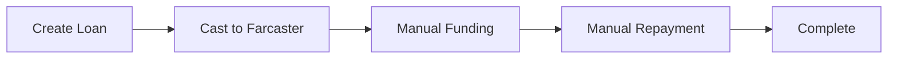

# LoanCast MVP
Social lending on Farcaster. No credit checks, no collateral—just reputation.

[](https://vercel.com/new/clone?repository-url=https://github.com/brightseth/loancast) [Live Demo](https://loancast.app) [Farcaster](https://warpcast.com/loancast)

## 🚀 MVP Overview
LoanCast is a simplified peer-to-peer lending platform built on Farcaster, enabling trust-based loans using USDC. **This is the MVP version focused on core functionality only.**

## ✨ Core MVP Features

### Essential Functionality
- 🏦 **P2P Lending** - Request and fund loans directly between users
- 💳 **USDC Payments** - All transactions in USDC on Base L2  
- 📈 **Fixed 2% Monthly Rate** - Simple, transparent pricing
- 🔐 **Sign In With Farcaster** - No passwords, just your Farcaster account
- 📢 **Auto-post to Farcaster** - Loan requests become casts

### Simplified Workflow
1. **Create** - User posts loan request as Farcaster cast
2. **Fund** - Lender funds via manual process (for now)
3. **Repay** - Borrower repays via manual process (for now)
4. **History** - Both parties see transaction records

## 🛠️ MVP Tech Stack
- **Frontend**: Next.js 14, TypeScript, Tailwind CSS
- **Backend**: Next.js API Routes, Supabase (PostgreSQL)
- **Auth**: Neynar SDK (Sign In With Farcaster)
- **Blockchain**: Base L2, USDC
- **Hosting**: Vercel
- **Webhooks**: Secure Neynar integration with HMAC verification

## 📋 Requirements
- Node.js 20+ (18 and below deprecated by Supabase)
- npm 9+
- Vercel account (for deployment)

## 🏃 Quick Start

### Prerequisites
- Node.js 20+
- npm or yarn
- Supabase account
- Neynar API key

### Installation
1. **Clone the repository:**
   ```bash
   git clone https://github.com/brightseth/loancast.git
   cd loancast
   ```

2. **Install dependencies:**
   ```bash
   npm install
   ```

3. **Copy environment variables:**
   ```bash
   cp .env.example .env.local
   ```

4. **Configure essential environment variables:**
   ```bash
   # Database (Supabase)
   DATABASE_URL=postgresql://...
   NEXT_PUBLIC_SUPABASE_URL=https://...
   NEXT_PUBLIC_SUPABASE_ANON_KEY=eyJ...
   SUPABASE_SERVICE_ROLE_KEY=eyJ...

   # Farcaster Integration (Neynar)
   NEYNAR_API_KEY=NEYNAR_...
   NEXT_PUBLIC_NEYNAR_CLIENT_ID=...
   NEYNAR_WEBHOOK_SECRET=your-webhook-secret
   WEBHOOK_OPERATOR_SECRET=your-operator-secret

   # App Configuration
   NEXT_PUBLIC_APP_URL=http://localhost:3000
   ```

5. **Set up the database:**
   - Create a new Supabase project
   - Run database migrations:
     ```bash
     npx supabase db push
     ```

6. **Start the development server:**
   ```bash
   npm run dev
   ```

Visit http://localhost:3000 to see the app.

## 📁 Simplified Project Structure
```
loancast/
├── app/                    # Next.js app router pages
│   ├── api/               # Core API routes only
│   │   ├── auth/neynar/   # Farcaster authentication
│   │   ├── loans/         # Loan CRUD operations
│   │   │   ├── route.ts   # Create/list loans
│   │   │   └── [id]/      # Individual loan operations
│   │   └── webhooks/      # Secure webhook handling
│   ├── loans/             # Loan pages
│   │   ├── page.tsx       # Borrower dashboard
│   │   ├── new/page.tsx   # Create loan
│   │   └── [id]/page.tsx  # Loan details
│   ├── explore/page.tsx   # Browse loans
│   └── page.tsx           # Landing page
├── components/            # Essential React components
│   └── LoanCard.tsx      # Core loan display
├── lib/                   # Core utilities only
│   ├── supabase.ts       # Database client
│   ├── neynar.ts         # Farcaster integration
│   ├── usdc.ts           # USDC calculations
│   ├── flags.ts          # Simple feature flags
│   ├── rate-limit.ts     # In-memory rate limiting
│   └── webhook-security.ts # Webhook security
└── supabase/             # Database schemas
    └── migrations/       # Database migrations
```

## 🔄 Simplified Loan Lifecycle



## 📊 MVP API Endpoints (Core Only)

### Essential Loan Operations
| Method | Endpoint | Description | Status |
|--------|----------|-------------|--------|
| `POST` | `/api/loans` | Create loan request | ✅ Active |
| `GET` | `/api/loans` | List loans with filters | ✅ Active |
| `GET` | `/api/loans/[id]` | Get loan details | ✅ Active |
| `POST` | `/api/loans/[id]/fund` | Fund loan (manual for MVP) | ✅ Active |
| `POST` | `/api/loans/[id]/mark-repaid` | Mark as repaid (manual for MVP) | ✅ Active |

### Authentication & Webhooks
| Method | Endpoint | Description | Status |
|--------|----------|-------------|--------|
| `POST` | `/api/auth/neynar` | Farcaster authentication | ✅ Active |
| `POST` | `/api/webhooks/neynar` | Secure webhook handling | ✅ Active |

### Disabled for MVP
| Feature | Status | Reason |
|---------|--------|---------|
| Admin Dashboard | 🚧 Disabled | Complexity reduction |
| Analytics/Stats | 🚧 Disabled | Focus on core features |
| Notifications | 🚧 Disabled | Simplified UX |
| Automated Repayment | 🚧 Manual | Security & simplicity |
| Credit Scoring | 🚧 Disabled | Over-engineered for MVP |
| Badges/Achievements | 🚧 Disabled | Nice-to-have |
| Email Reminders | 🚧 Disabled | Non-essential |
| Cron Jobs | 🚧 Disabled | Manual processes |

## 🔐 Security Features (Production-Ready)

### Webhook Security
- ✅ **HMAC Verification** - All Neynar webhooks verified with timing-safe comparison
- ✅ **Timestamp Validation** - Prevents replay attacks (5-minute window)
- ✅ **Rate Limiting** - 30 webhooks/minute per FID
- ✅ **Idempotency** - Duplicate events processed once only
- ✅ **Abuse Detection** - Blocks obvious spam patterns

### API Security
- ✅ **In-Memory Rate Limiting** - Simple, database-independent
- ✅ **Input Validation** - Zod schemas for all inputs
- ✅ **Row Level Security** - Database-level access controls
- ✅ **Audit Trail** - All loan state changes logged

### Manual Processes (MVP Safety)
- ✅ **Manual Funding** - Admin approval prevents auto-funding abuse
- ✅ **Manual Repayment** - Verified processes prevent spoofing
- ✅ **No Auto-Funding from Replies** - Prevents text-based exploits

## 🚀 Deployment

### Environment Variables Required
```bash
# Essential
DATABASE_URL=
NEXT_PUBLIC_SUPABASE_URL=
NEXT_PUBLIC_SUPABASE_ANON_KEY=
SUPABASE_SERVICE_ROLE_KEY=
NEYNAR_API_KEY=
NEXT_PUBLIC_NEYNAR_CLIENT_ID=
NEYNAR_WEBHOOK_SECRET=
WEBHOOK_OPERATOR_SECRET=
NEXT_PUBLIC_APP_URL=

# Optional
NEXT_PUBLIC_POSTHOG_KEY=
SENTRY_AUTH_TOKEN=
```

### Deploy to Vercel
1. Push code to GitHub
2. Connect Vercel to your repository
3. Add environment variables in Vercel dashboard
4. Deploy automatically

## 📈 What's Next (Post-MVP)

Once the MVP is stable and has real users:

### Phase 2: Automation
- Automated funding via collect events
- On-chain repayment verification
- Background job processing

### Phase 3: Enhanced UX
- Notification system
- Advanced analytics
- Reputation scoring

### Phase 4: Scale Features
- Admin dashboard
- Complex reputation system
- Achievement badges
- Email integration

## ❓ MVP FAQ

**Q: Why is funding manual?**
A: Security and simplicity. Automated funding had too many edge cases and abuse vectors for MVP.

**Q: Where are the notifications?**
A: Removed to focus on core workflow. Users check the app directly.

**Q: What happened to the reputation system?**
A: Simplified to basic completion tracking. Complex scoring comes later.

**Q: Can I still see loan history?**
A: Yes! Basic loan history and status tracking remains.

**Q: Is this production-ready?**
A: Yes, with manual processes. The core is secure and stable for real users.

## 🛠️ Contributing

This MVP focuses on **simplicity and stability**. Before adding features:

1. **Ask**: Does this belong in MVP or post-MVP?
2. **Simple**: Can this be done more simply?
3. **Core**: Does this serve the core user journey?
4. **Safe**: Does this introduce security risks?

## 📄 License

MIT License - see LICENSE file for details.

---

**MVP Principle**: Ship something simple that works rather than something complex that breaks. ✨