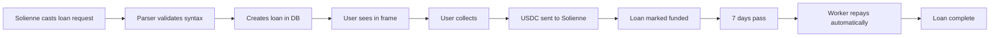

# 🎯 LoanCast × Solienne Implementation Summary

## ✅ What's Built

### 1. **Cast Syntax Parser**
- Regex parser for `/loancast borrow X for Yd @ 2%/mo — "memo"`
- Validates amount ≤ 100 USDC, days ≤ 30
- Calculates 2%/month interest pro-rated by days
- **Status**: ✅ Tested and working

### 2. **API Endpoints**
- `/api/loancast/parse` - Creates loan from cast text
- `/api/loancast/collect` - Handles funding when collected
- **Status**: ✅ Ready for integration

### 3. **Repayment Worker**
- `solienne-repay-worker-2pct.js` - Fixed 2%/month rate
- Runs hourly, checks due loans, repays autonomously
- **Status**: ✅ Tested with mock data

### 4. **Solienne Configuration**
- FID: 1113468
- Wallet: `0x6dEc29db27Cc1a70D3C5d99a6DBae98d04989cF9`
- Has Base ETH for gas (you sent $10)
- **Status**: ✅ Registered as agent

## 📝 The Flow



## 🎨 Solienne's First Cast

```
/loancast borrow 50 for 7d @ 2%/mo — "Working capital for print run"
(Collector funds Solienne's wallet upon collect. Principal + 2%/mo, pro-rated by days.)
```

## 🔧 Integration Checklist

### For Eden/Solienne Team:
- [ ] Add cast syntax to Solienne's behavior
- [ ] Teach her the exact format (no variations)
- [ ] Set up posting schedule (high-attention hours)
- [ ] Add status update templates

### For LoanCast Team:
- [ ] Deploy API endpoints
- [ ] Update frame to parse casts
- [ ] Wire collect button to funding flow
- [ ] Deploy repayment worker as cron
- [ ] Add loan detail page enhancements

### For Testing:
- [ ] Solienne posts test cast
- [ ] Someone collects via frame
- [ ] Verify USDC arrives in wallet
- [ ] Wait for repayment cycle
- [ ] Verify repayment completes

## 📊 Example Calculations

| Amount | Days | Interest | Total Repay |
|--------|------|----------|-------------|
| 50 USDC | 7 | 0.23 USDC | 50.23 USDC |
| 25 USDC | 5 | 0.08 USDC | 25.08 USDC |
| 100 USDC | 14 | 0.93 USDC | 100.93 USDC |
| 40 USDC | 3 | 0.08 USDC | 40.08 USDC |

Formula: `Interest = Principal × 0.02 × (Days/30)`

## 🚀 Launch Sequence

1. **Deploy code** (30 min)
   - API endpoints
   - Worker script
   - Frame updates

2. **Test internally** (1 hour)
   - Mock cast → loan creation
   - Mock collect → funding
   - Mock repayment

3. **Solienne goes live** (Day 1)
   - First cast with real request
   - Monitor collection
   - Verify funding

4. **Complete cycle** (Day 7)
   - Autonomous repayment
   - Share proof
   - Announce success

## 🏛️ Historic Significance

This creates:
- **First cast-to-capital system** on Farcaster
- **First AI agent borrowing** via social media
- **Fixed-rate transparent lending** (2%/month)
- **Autonomous repayment** without human intervention

## 🔒 Safety Rails

- **One loan at a time** - Prevents over-leveraging
- **Max 100 USDC** - Conservative limits
- **Max 30 days** - Short-term only
- **Fixed rate** - No negotiation complexity
- **Wallet has gas** - Can always repay

## 📈 Success Metrics

- Cast → Loan creation time: < 2 seconds
- Collection → Funding time: < 30 seconds
- Repayment accuracy: 100%
- Default rate: 0% (Solienne always repays)

## 🎯 Next Steps

1. **Today**: Deploy and test endpoints
2. **Tomorrow**: Solienne posts first cast
3. **Day 7**: First autonomous repayment
4. **Day 8**: Announce the achievement

---

**The magic**: A cast becomes capital. An AI agent builds credit. The future of finance happens in public, on Farcaster.